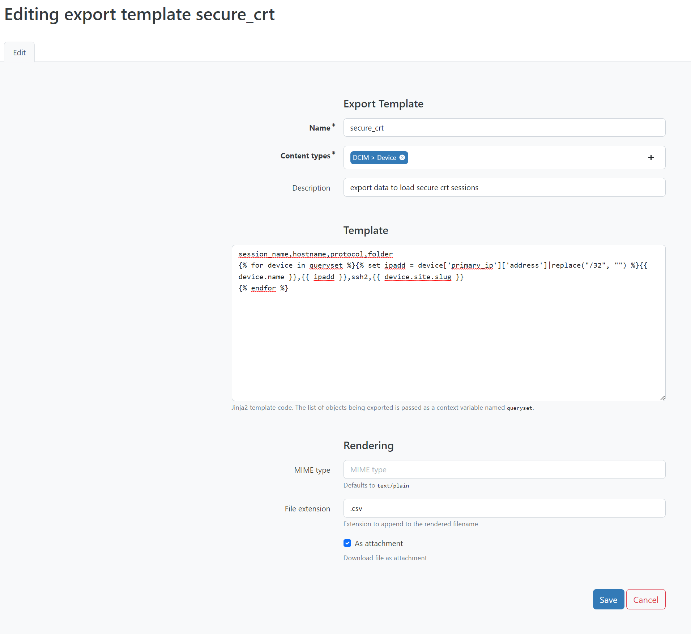
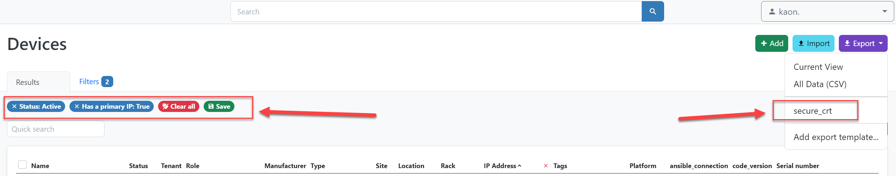
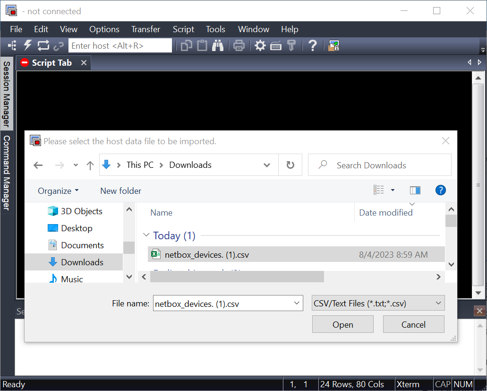
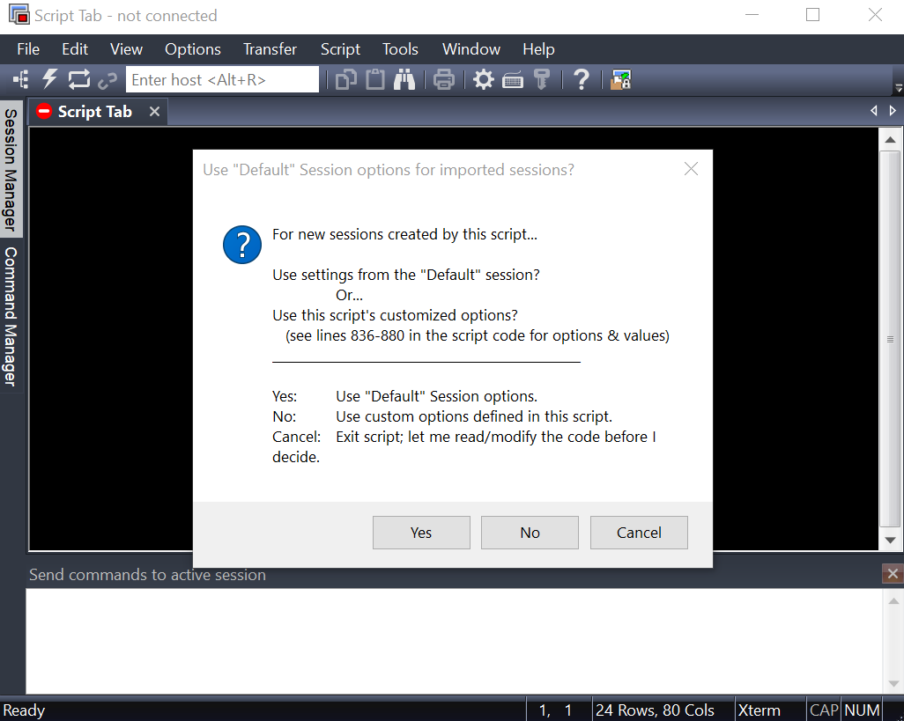

# How To Export Devices from Netbox to SecureCRT
Guide on how to create a Netbox export template to prepare a secureCRT import file

## Create Netbox Custom Export Template
- In Netbox go to Other --> Export Templates --> Add
- Give it a name
- Content types: DCIM > Device
- Description
- Template:
```jinja2
session_name,hostname,protocol,folder
{{ device.name }},{{ ipadd }},ssh2,{{ device.site.slug }}

```
- file extension: .csv
- download as attachment (checked)

**This template would create a CSV with the columns: session_name, hostname, protocol, folder**
[Reference Link](https://www.vandyke.com/support/tips/importsessions.html)



## Choose your devices to export
- In Netbox go to Devices --> Filters --> Choose your filters
    - For example, export all **active** devices with a **primary IP**
- Export the data to your **secure_crt** template
- Now you will have a CSV ready for secureCRT:
  - session_name: The value that will be used for the secureCRT session’s name.
  - hostname: The hostname or IP address for the remote server.
  - protocol: The protocol to be used for connecting with the session (SSH2)
  - folder: A relative folder path for the specified session as displayed in the Session manager. In this case, the device site slug from netbox will be used as the folder.



## Import the data export into SecureCRT
1) Download the `ImportArbitraryDataFromFileToSecureCRTSessions.py` file from the [secureCRT website](https://www.vandyke.com/support/scripting/scripting-examples/import-arbitrary-data-from-file-to-securecrt-sessions.html)
2) Create a backup of your current secureCRT sessions
3) Delete all current sessions/folders in secureCRT (if you don't want duplicates)
4) In secureCRT:
-  go to Script --> Run --> Find `Import ImportArbitraryDataFromFileToSecureCRTSessions.py` file
-  Select the CSV file (that you exported from Netbox)
-  Import using default sessions



