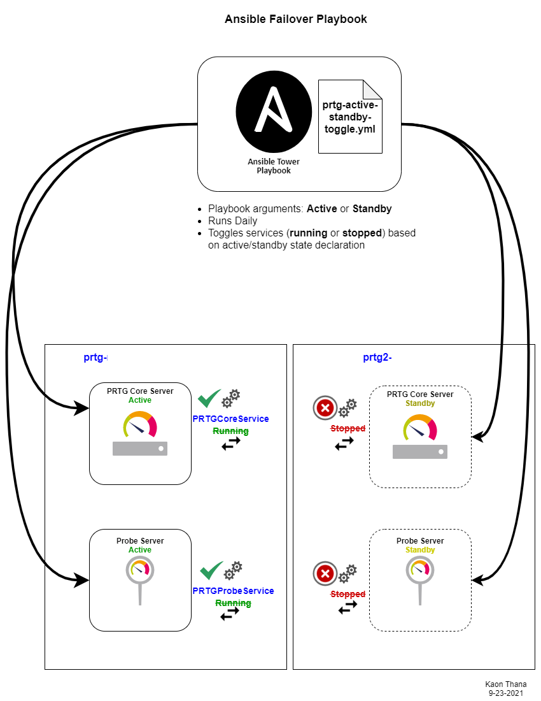
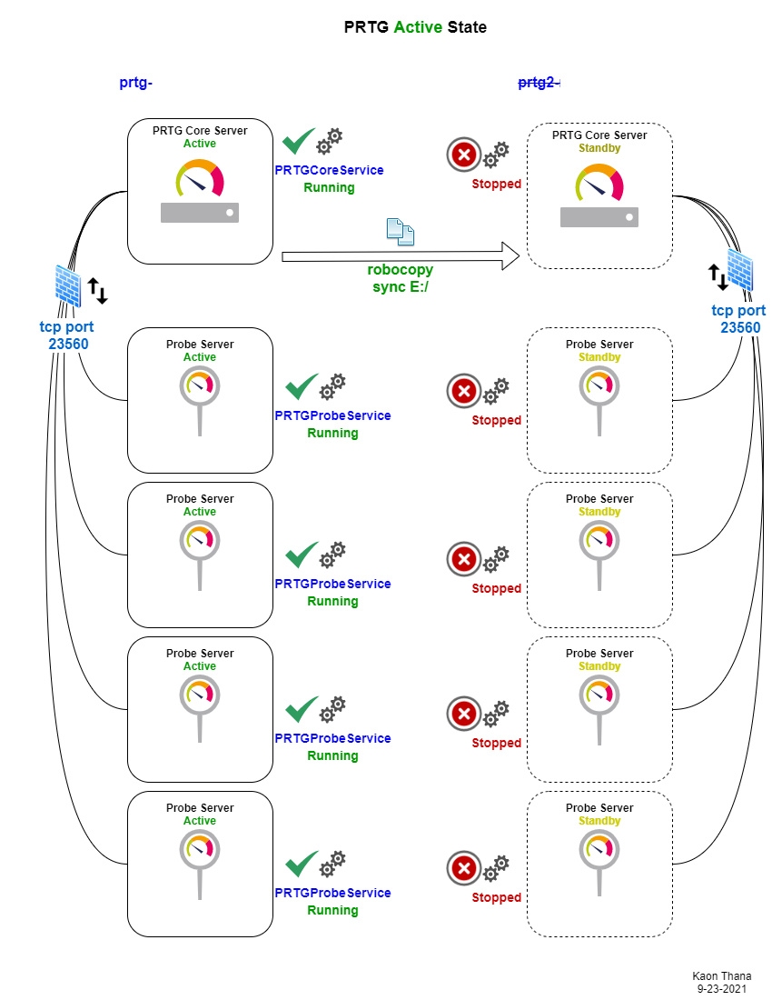
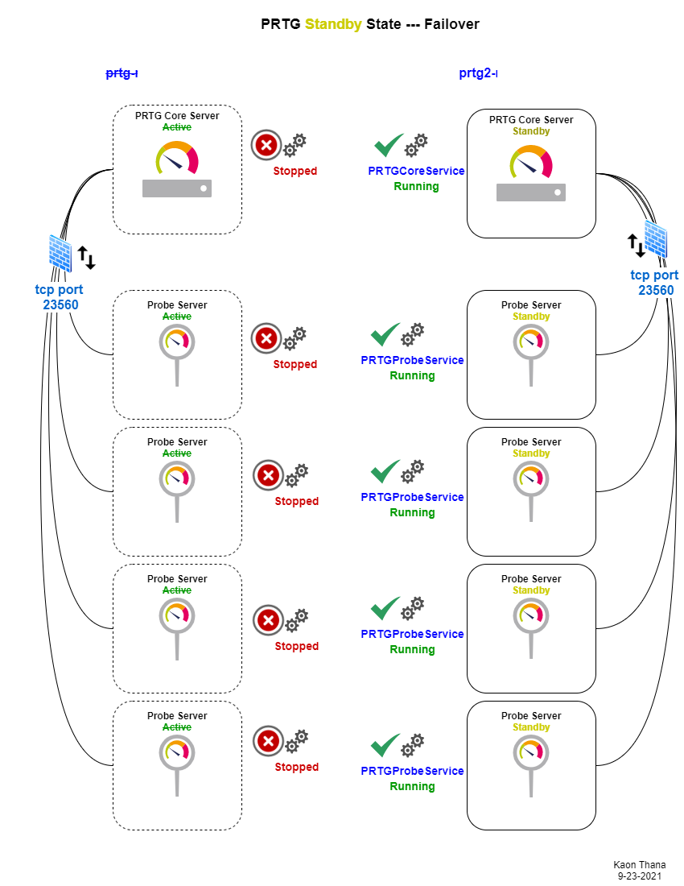

# Purpose
This repo is the home for various ansible playbooks written to interact with the PRTG API and help with day-to-day operations and maintain desired monitoring state.

## Add New Device to PRTG and Netbox (Bulk)
The playbook [bulk_add_new_device_netbox_prtg](bulk_add_new_device_netbox_prtg.yml) and its corresponding task list [bulk_add_tasks](bulk_add_tasks.yml) are used to add a new network device to both PRTG and Netbox.
- We clone an existing device in PRTG and place the new object inside the corresponding Site mapped in netbox (same site ID)
- In netbox, we add the device, IP, role, type and tag it with the 'PRTG' tag
- The PRTG tag in netbox is used later to check that all devices in netbox are also in PRTG (compliance check)

## PRTG to Netbox Sync Checker
The playbook [netbox-to-prtg-sync](netbox-to-prtg-sync.yml) queries the device list of PRTG and queries all devices in Netbox tagged with 'PRTG' label. 

It performs a diff against both lists and alerts if there is a difference. This is scheduled daily so that we know if a new device was added to PRTG (or Netbox) and not put in the corresponding system. 

This play helps keep our Source of Truth in sync with monitoring. 

## PRTG Sync Databases to Backup Core
The playbook [prtg-sync-db-daily](prtg-sync-db-daily.yml) runs daily to incrementally sync the primary core server to the backup core server. We sync the two primary drives:
- "E:\ProgramData\Paessler" 
- "E:\Program Files (x86)\PRTG Network Monitor"
- robocopy args = /mir /zb /mt:16 /tbd /r:1 /w:3 /fft /np

## PRTG Windows Service Checker
The playbook [prtg-service-checker](prtg-service-checker.yml) is used to maintain core and probe server states. In ACTIVE mode, we confirm that the primary core and probe windows services are running and the standby services are manually stopped. This prevents accidental turn up of services and split-brain scenarios. In STANDBY mode, we flip the services on all the cores and probes. This is usually done for software upgrades (maintenance windows).

Illustration of the playbook and architecture:

